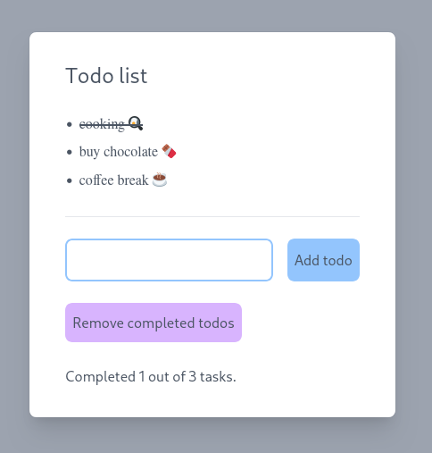

<div align="center">

# todolist
yew webserver showing a simple todo list


</div>


## Screenshot



## Usage
Compile and serve with [trunk](https://trunkrs.dev/):
```sh 
trunk serve --open
```
The default settings are to host on [localhost:8080]("http://localhost:8080"), address and port can be changed in the `Trunk.toml` file.
